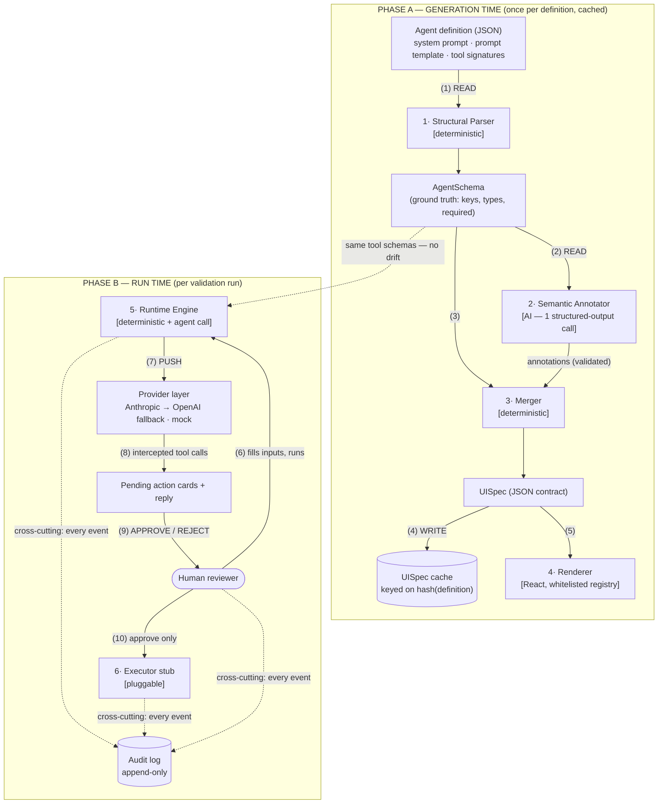
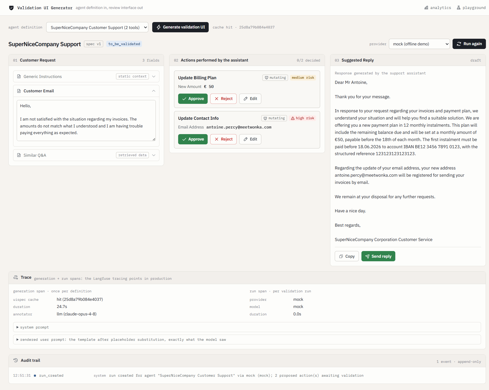
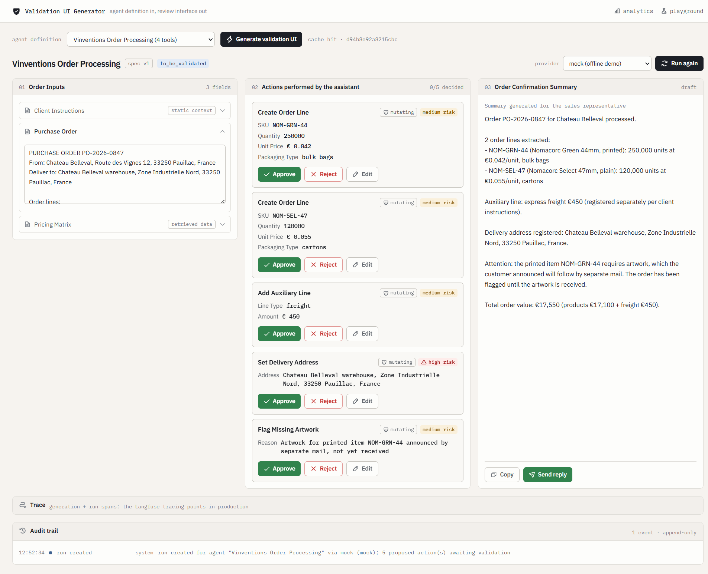

# Validation UI Generator

Generates a **Human-in-the-Loop validation interface** from an AI agent definition — the prompting structure, expected inputs and available tools — instead of hand-building a UI per automation.

## 1. Purpose

Every agent automation ends the same way: a human reviews what the agent wants to do before it happens. Today that validation UI is built per project, by hand. This prototype turns the agent **definition** into the validation UI automatically: point it at a definition file and it produces the three-panel review screen — run inputs, proposed actions with per-action APPROVE/REJECT, and the generated reply — with **no per-agent code**.

Framed in delivery terms: for a case like the reference project (tens of orders per week, ~15 minutes of manual work each, ROI measured in months), the validation UI is a hand-built React component. With a generator, the next customer agent costs a definition file instead of a UI build — the Human-in-the-Loop layer becomes a reusable product asset instead of a per-project deliverable.

Two hard constraints from the assignment drove the design:

- *"The goal is not to build a UI for one specific run result"* — generation works from the agent definition; run results only populate the generated shell.
- *"The approach should remain reusable across different automation domains"* — proven here with two live domains (customer support and order processing) through the same pipeline.

## 2. Requirements

| Tier | Requirement |
|---|---|
| **Necessary** | Generate the UI from the definition (never hardcode per agent) · deterministic extraction of structure (placeholders, tools, parameter types — including `optional(...)`) · tolerate imperfect definitions (the example's typo'd keys and a missing closing parenthesis) · per-action APPROVE/REJECT · **no tool execution before human approval, ever** · editable action parameters before approval (the reference project's "all order fields are editable"), re-validated server-side · empty optional parameters omitted from action cards · full audit trail on every action · API keys server-side only |
| **Important** | Semantic quality (human labels, panel titles, field roles) via one validated LLM call with a deterministic fallback · provider abstraction with automatic fallback (Anthropic → OpenAI) · UISpec cached per definition · idempotent decisions (a double-click, replay or concurrent request can never execute twice) |
| **Nice-to-have** | Offline mock provider for demos · run state machine badge (`to_be_validated → confirmed/rejected`) · cache/duration indicator · undeclared-argument flagging on action cards · `/playground`: paste any definition and watch the UI generate live (deterministic pipeline in-browser, annotator behind a button) · rule-based risk badges per action (low/medium/high; high needs a second confirmation click) |

## 3. High-Level Design

**Core idea: the LLM is a compiler, not a runtime.** Generation (expensive, semantic, cacheable) is strictly separated from run time (deterministic apart from the agent call itself). Structure is *never* produced by an LLM; presentation semantics are *never* hardcoded.



Legend: solid arrows = data flow (READ/PUSH as labeled) · dotted = cross-cutting · numbers refer to the data-flow steps below. Components are labeled **[deterministic]** vs **[AI]** — where non-determinism lives is a first-class architecture question here.

### Components

1. **Structural Parser** (`src/lib/parser.ts`) — deterministic. Extracts `{{placeholders}}` (regex + template-label capture), parses tool signatures with a small grammar (`float | int | str | bool | optional(T)`, unknown types degrade to a generic field), detects the trailing completion marker (`answer :`). Recovers from broken syntax — the assignment's own second tool signature is missing its closing parenthesis, and the fixture keeps it that way. Output: **AgentSchema**, the ground truth. Structure cannot hallucinate because no model touches it.
2. **Semantic Annotator** (`src/lib/annotator.ts`) — AI, exactly one structured-output call per definition. Produces presentation metadata only: human labels ("Email Content" for the typo'd key `custome_mail`), panel titles, field-type hints (`float` + "in euros" → currency), and placeholder roles (`primary` / `context` / `retrieved` — why the example UI shows the customer mail but not the generic instructions). Zod-validated; one retry with the validation error as context; on failure the pipeline continues with deterministic labels. It can never add, drop or retype a field: the merger iterates the parser's keys and merely looks up annotations.
3. **Merger** (`src/lib/merger.ts`) — deterministic. Joins AgentSchema ⋈ annotations into the **UISpec**. Type hints are constrained to the structural type (a `float` may present as `currency`, never as `text`; `required` always comes from the parser). Missing annotations fall back to the template label, then `titleCase(key)`.
4. **Renderer** (`src/components/`) — a fixed, whitelisted component registry that renders UISpec JSON. No `eval`, no `dangerouslySetInnerHTML`; every value is an escaped text node. Unknown field types render as a plain text input rather than crashing.
5. **Runtime Engine** (`src/app/api/run/route.ts` + `src/lib/providers/`) — renders the prompt template with the reviewer's inputs and calls the provider with tool schemas derived from the **same AgentSchema** that generated the UI (one source of truth — the UI can never disagree with the tools the model was given). The provider loop is **side-effect-free**: every tool call the model makes is intercepted and acknowledged as *queued for human validation*, letting the model finish its reply while nothing executes. Capped turns and `max_tokens` on every call (the assessment keys are shared).
6. **Executor + audit** (`src/lib/executor.ts`, `src/lib/store.ts`) — the executor is a pluggable interface with a mock implementation, called from exactly one place, only after a human clicked APPROVE, and at most once per action (replays get HTTP 409). Before approving, the reviewer can **edit an action's arguments** (correct-and-confirm — the reference project's "all order fields are editable"): the card's fields become the same whitelisted inputs as panel 1, and the server re-validates every edited value against the parsed parameter types (`src/lib/edits.ts`, Zod-coerced — a `float` stays a float, a required param can't be cleared, undeclared arguments are never editable) before the decision is recorded. Every event — run created, edited, approved, rejected, executed, reply sent, status change — appends to the audit log.

### Data flow (definition → validation UI)

1. `POST /api/generate` reads the agent definition file (READ).
2. Structural Parser produces the AgentSchema (deterministic, always succeeds).
3. Semantic Annotator makes one structured-output LLM call about that schema (AI); the Merger validates and joins the result — or degrades to deterministic labels.
4. The resulting UISpec is written to the cache, keyed on `hash(definition)` (WRITE) — later generates are cache hits until the definition changes.
5. The React renderer draws the three panels from the UISpec — fields, action cards and output panel are data, not code.
6. The reviewer fills the input fields (sample inputs prefill them) and starts a run (internal trigger).
7. The Runtime Engine renders the user prompt and calls the provider chain with the AgentSchema's tool schemas (PUSH).
8. Tool calls come back intercepted — they appear as **pending** action cards; the generated text lands in the output panel. Nothing has executed.
9. The reviewer approves or rejects each action independently — optionally correcting its arguments first (re-validated server-side against the AgentSchema types, audited as `action_edited`); every decision is final and audited.
10. Only an APPROVE reaches the executor (exactly once); the suggested reply is likewise only sent by a human click. Cross-cutting: every step appends to the audit trail.

### The UISpec contract

The language-agnostic JSON at the boundary between generation and rendering (`src/lib/types.ts`):

```ts
interface UISpec {
  version: 1;
  agentTitle: string;
  inputPanel:  { title: string; fields: Field[] };
  actionsPanel: { title: string; actions: ToolAction[] };
  outputPanel: { title: string; type: "generated-text"; description: string };
}
interface Field      { key: string; label: string; type: FieldType; required: boolean; role?: "primary" | "context" | "retrieved" }
interface ToolAction { toolName: string; label: string; mutating: boolean; fields: Field[] }
type FieldType = "text" | "longtext" | "number" | "currency" | "email" | "boolean" | "unknown";
```

This prototype is Next.js/TypeScript for iteration speed; the contract is deliberately implementation-neutral. In a Python/FastAPI backend the Zod schemas translate 1:1 to Pydantic models (`UISpecSchema` ↔ `class UISpec(BaseModel)`) — the contract is the design, TypeScript is just this prototype's spelling of it.

## 4. Setup

Prerequisites: Node 20+.

```bash
git clone <this repo>
cd wonka-assessment
npm install
cp .env.example .env.local   # fill in the provided ANTHROPIC_API_KEY / OPENAI_API_KEY
npm run dev                  # http://localhost:3000
```

Then: pick an agent definition → **Generate validation UI** → **Run agent** → approve/reject each action. No database or other infrastructure; local state lives in `.data/` (gitignored). `npm test` runs the parser suite against the assignment's verbatim text — typos, missing parenthesis and all — plus the edit-validation and risk-rule suites.

Environment variables (server-side only, never exposed to the client):

| Variable | Purpose |
|---|---|
| `ANTHROPIC_API_KEY` | Primary provider (annotator + agent runs) |
| `OPENAI_API_KEY` | Fallback provider (agent runs) |
| `ANTHROPIC_MODEL` / `OPENAI_MODEL` | Optional model overrides (default `claude-opus-4-8` / `gpt-4o`) |

## 5. Adding a new agent — the actual test of this system

Drop one JSON file in `fixtures/` — no code changes anywhere:

```jsonc
{
  "id": "deploy-approval-agent",
  "name": "Deploy Approval",
  "definition": {
    "system_prompt": "You are a release agent ...",
    "user_prompt_template": "Change summary :\n{{change_summary}}\nPipeline status :\n{{pipeline_status}}\ndecision :",
    "tools": [
      { "signature": "trigger_deploy(environment : str, version : str)", "description": "deploys the given version" },
      { "signature": "rollback(reason : optional(str))", "description": "rolls back the previous release" }
    ]
  },
  "sampleInputs": { "change_summary": "…", "pipeline_status": "…" },
  "mockResult": { "toolCalls": [], "replyText": "…" }
}
```

(`sampleInputs` prefills the demo; `mockResult` powers the offline mock provider — both optional.)

It appears in the dropdown, generates its own validation UI, and runs through the same approval flow. The two included fixtures demonstrate this across domains: `supernicecompany.json` (the assignment example, **verbatim, typos included**) and `vinventions-orders.json` (an order-processing agent modeled on the reference project: order-line extraction against a pricing matrix with packaging type, auxiliary lines for pallets/freight/rebates, delivery address, missing-artwork exception). The Vinventions fixture deliberately demonstrates only the **order-extraction and validation slice** of that case; the client-identification mode, artwork identification, quick actions and auto-load-next queueing are out of scope for this prototype (queueing is also listed under known limitations).

For an even faster proof, **`/playground`** skips the file entirely: paste or edit a definition and the validation UI generates **live on every keystroke** — possible because the structural half of the pipeline (parser + merger) is pure, deterministic TypeScript that runs in the browser with no LLM involved. The one AI step (the annotator) sits behind an explicit button and reuses the exact server pipeline; nothing in the playground is cached or persisted. The raw UISpec JSON is inspectable next to the rendered preview, making the generation contract itself part of the demo.

## 6. Assumptions

- **The agent definition is trusted developer input** (written by the team deploying the agent). Run inputs and model outputs are *not* trusted — see security below. Multi-tenant definition upload would make the definition itself an injection surface; out of scope here.
- **Placeholder roles need semantics.** The example UI shows the customer mail but hides generic instructions and retrieved Q&A — that distinction isn't derivable structurally. It comes from the annotator; if annotation fails, the fallback shows *every* field prominently (safe direction: show more, hide nothing).
- **Reject is a decision, not a retry.** Rejecting an action records it and skips execution; it does not re-prompt the agent. A targeted "reprocess" is a separate human action (**Run again**), mirroring the reference project's surgical reprocess.
- **The executor is a stub.** There is no real ERP/CRM behind this prototype; the executor interface is where a real backend plugs in. The mock still runs strictly post-approval — the gate is the point, not the backend.
- **One agent per validation screen.** The UISpec extends naturally to multi-agent flows (a `sections: AgentSection[]` level per pipeline step, each with its own actions, driven by a state machine like the reference's kanban states) — designed for, deliberately not built in a 4-hour scope.
- **UI language is English**; amounts render with a € hint when the type resolves to `currency`.

## 7. Technical considerations

- **Extensibility** — new domain = new definition file (proven live with two domains). New field types are one entry in the type registry + one renderer case; unknown inputs already degrade gracefully, so extension is additive. The UISpec is versioned (`version: 1`, the badge in the UI) for forward migration, and the multi-agent path is a schema extension, not a rewrite.
- **Reliability** — the generation pipeline cannot hard-fail: structure is deterministic, and the only AI step is Zod-validated with one error-context retry and a deterministic fallback (degraded labels, never a crash). The LLM cannot invent or lose fields by construction (the merger iterates parser keys only). Decisions are idempotent server-side, and that guarantee holds under concurrency and crashes, not just for a double-click: the whole read-check-execute-write per decision is serialized per run (`src/lib/lock.ts` — an in-process mutex where a production system would use a database transaction), so concurrent replays hit the 409 gate instead of racing past it, and the decision is persisted **write-ahead** — before the executor runs — so a process dying mid-execution replays into a 409, never a second execution.
- **Security** — keys live in server-side env vars only, never client-side, never logged, gitignored (`.env.example` documents them). **No side effect before approval is the core invariant**: the provider loop acknowledges tool calls without executing; the executor has exactly one call site, behind the human gate. Model output is untrusted content — rendered as escaped text through a whitelisted registry (no eval, no raw HTML). Prompt injection via run inputs (e.g. a malicious customer mail instructing the agent) is mitigated at the review layer: resolved parameter values are shown prominently on each card, undeclared arguments are flagged, and the mutating/read-only classification of a tool is derived deterministically from the schema — never delegated to the model. The same line extends to **risk badges** (`src/lib/risk.ts`): four rule-based checks — R1 read-only & fully declared → low; R2 mutating → medium; R3 anything outside the declared schema → high; R4 mutating + a fraud vector from the reference case (currency amount at/above a per-agent `policy.currencyThreshold`, default €1000, or a contact/address change — invoice & delivery redirection) → high. High-risk approvals require a second, explicit confirmation click. The model that proposed an action never grades its own risk. Edited arguments are equally untrusted: the client only proposes strings, and the server re-validates each edit against the parsed parameter types before recording the decision — an invalid edit rejects the whole request and the action stays pending. Costs are bounded (capped `max_tokens`, capped loop turns, reduced retries — the assessment keys are shared).
- **Observability** — every pipeline step reports itself (generation duration, cache hit/hash, annotation source and model, provider fallback warnings surface in the UI), and the append-only audit trail records every run, decision, execution and status change ("full audit trail on every action"). A collapsible **trace panel** under each run makes the two spans explicit: the generation span (cache hit/miss, duration, annotator source + model) and the run span (provider after fallback, model, duration, fallback path, plus the system prompt and the rendered user prompt — exactly what the model saw). In production those two spans are the natural Langfuse tracing points; the provider layer is the gateway seam (Requesty-style) where routing/cost tracking attach. Traces carry prompts and metadata only — never keys.
- **Performance** — the expensive step (LLM annotation) runs once per definition and is cached on `hash(definition)`; regeneration is a cache read (visible in the UI: ~5–25s fresh vs instant hit). The run path contains zero LLM calls except the agent call itself. The UISpec cache also makes generation idempotent.

## 8. Known limitations / future work

- **Real executor integrations** behind the `ToolExecutor` interface (per-tool endpoints, retries, compensation).
- **Multi-agent validation screens** — schema path described in Assumptions; kanban-per-state UX like the reference project.
- **Langfuse export** — the in-app trace panel already shows the generation and run spans; shipping them to Langfuse is the remaining wiring.
- **Queue/batch review** (auto-load next run) — the `1 / 1` counter is honest about the single-run demo scope.
- Tool-signature grammar covers the assignment's type language plus obvious neighbours; nested/composite types (`list(...)`, objects) currently degrade to a generic field by design and would extend the registry recursively.

## 9. Beyond the requirements (optional bonus)

Additional work included because each piece strengthens the core proposal — every item traces back to the assignment or the reference project, none is a free-floating feature:

- **Edit-before-approve on action parameters** — the reference project's *"all order fields are editable"* necessity: the reviewer corrects-and-confirms instead of only vetoing; every edit is re-validated server-side against the parsed types and audited as `action_edited`.
- **Deterministic risk badges** (low/medium/high, high requiring a second confirmation click) — extends the design line "safety judgments are never delegated to the model" from mutating-classification to risk triage, with the reference case's fraud vectors (amount thresholds, contact/address changes) as rules.
- **`/playground`** — live proof of *"reusable across different automation domains"*: paste any definition and watch the UI generate on every keystroke, possible only because the structural pipeline is LLM-free.
- **Per-run trace panel** — the generation span and run span visible in the UI: exactly the Langfuse tracing points from the reference stack, minus the export wiring.
- **Hardened decision path + test suite** — per-run serialization and write-ahead persistence make the approval gate hold under concurrent requests and crashes; 42 tests cover the parser (against the assignment's verbatim text), edit validation and the risk rules.

## 10. Screenshots

**Assignment example — SuperNiceCompany customer support** (verbatim definition, typos included; offline mock run; note the omitted empty `phone_number`, the € type hint on the billing amount, the deterministic risk badges — the contact change is HIGH and needs a second confirmation click — the **Edit** button on every pending card, and the expanded trace panel with the generation and run spans):



**Reusability proof — Vinventions-style order processing** (same pipeline, different domain, annotated live by `claude-opus-4-8`: tiered pricing applied from retrieved context, packaging per order line, an auxiliary freight line, five independent approvals with risk badges — the delivery-address change is flagged HIGH — and exception flagging):



## 11. Actual time spent

Roughly **4 hours** end to end: ~1.5h analysis and design (assignment + reference document, architecture decisions), ~2h implementation and live testing, ~0.5h documentation. Built AI-assisted (Claude Code); every architectural decision, trade-off and line of this document was reviewed by hand.
