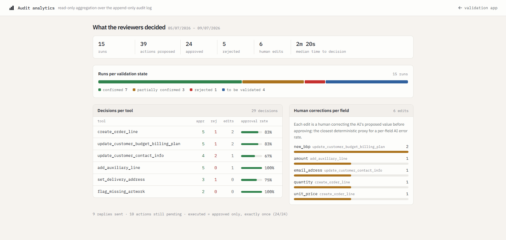

# Validation UI Generator

Give this tool the definition of an AI agent (its prompts and its tools) and it builds the review screen a human uses to check the agent's work before anything actually happens. No custom code per agent.

## 1. Purpose

When a company automates work with an AI agent, a person still has to approve what the agent wants to do. Today that review screen is built by hand for every project. This prototype generates it automatically from the agent definition file, with three panels: the run inputs, every proposed action with its own APPROVE / REJECT buttons, and the reply the agent wrote.

The payoff: the next customer's agent costs one definition file instead of a UI build. Two rules from the assignment shaped the design:

- *"The goal is not to build a UI for one specific run result"* — the UI is generated from the definition; run results only fill it in.
- *"The approach should remain reusable across different automation domains"* — proven with two working domains (customer support and order processing) through the same pipeline.

## 2. Requirements

| Tier | Requirement |
|---|---|
| **Necessary** | UI generated from the definition, never hardcoded per agent · structure extracted with plain code, not AI (placeholders, tools, parameter types incl. `optional(...)`) · handles imperfect definitions (the example's typos and missing parenthesis) · APPROVE/REJECT per action · **nothing executes before a human approves** · action parameters editable before approval, re-checked on the server · empty optional parameters left off the cards · everything logged · API keys server-side only |
| **Important** | Readable labels and field roles from one strictly validated AI call, with a non-AI fallback · Anthropic → OpenAI provider fallback · generated screen cached per definition · a decision can never run twice (double-click, replay or concurrent request) |
| **Nice-to-have** | Offline mock provider · run status badge · cache/duration indicator · warning on undeclared arguments · `/playground` live generation · rule-based risk badges (high asks a second confirmation) · `/dashboard` with approval stats from the audit log |

## 3. High-Level Design

**Core idea: the AI model helps *prepare* the screen once; it never *decides* what is on it.** The smart work happens one time per definition and is cached; everything after that is plain, predictable code — except the agent call itself. The screen's structure never comes from the model; the wording never gets hardcoded.


**[deterministic]** = plain code, same input always gives the same output; **[AI]** = the one model call. Numbers match the data-flow steps below.

### Components

1. **Structural Parser** (`src/lib/parser.ts`) — plain code. Extracts the facts from the definition: `{{placeholders}}`, tools, parameter types (`float | int | str | bool | optional(T)`; unknown types become a generic field) and the answer marker. Survives broken input — the assignment's second tool signature is missing its closing parenthesis, and the fixture keeps it that way. Output: the **AgentSchema**, the single source of truth. No model touches it, so it can never invent fields.
2. **Semantic Annotator** (`src/lib/annotator.ts`) — the only AI step: one call per definition, presentation only. Readable labels ("Email Content" for the typo'd `custome_mail`), panel titles, display hints (a `float` "in euros" shows as currency), and which inputs are the main content versus background. The answer must match a strict schema (Zod); one retry, then a fallback to auto-generated labels. It cannot add, remove or retype fields.
3. **Merger** (`src/lib/merger.ts`) — plain code. Combines schema + annotations into the **UISpec**, the JSON that describes the screen. It walks the parser's fields only, so an AI suggestion that conflicts with the real structure loses.
4. **Renderer** (`src/components/`) — a fixed set of React components draws the UISpec. No `eval`, no raw HTML; everything from a model renders as escaped plain text. Unknown field types become a text box, not a crash.
5. **Runtime Engine** (`src/app/api/run/route.ts` + `src/lib/providers/`) — fills the prompt template and calls the model with tool definitions built from the **same AgentSchema** the UI came from, so screen and tools can't disagree. Every tool call the model makes is caught and answered with "queued for human validation" — the model finishes its reply while **nothing runs**. Tokens and turns capped (the assessment keys are shared).
6. **Executor + audit** (`src/lib/executor.ts`, `src/lib/store.ts`) — the executor is a stub where a real backend (ERP/CRM) plugs in. One call site, only after APPROVE, at most once per action (a repeat gets HTTP 409). Before approving, the reviewer can **edit an action's parameters**; the server re-checks every edit against the parsed types (`src/lib/edits.ts`) — a number stays a number, required parameters can't be emptied, undeclared parameters can't be edited. Every event lands in the append-only audit log.

### Data flow (definition → validation UI)

1. `POST /api/generate` reads the agent definition file.
2. The parser produces the AgentSchema (always succeeds).
3. The annotator makes its one AI call; the merger checks and combines the result — or falls back to auto labels.
4. The UISpec is cached on a hash of the definition; regenerating is free until the definition changes.
5. React draws the three panels from the UISpec — fields and cards are data, not code.
6. The reviewer fills the inputs (samples prefill them) and starts a run.
7. The runtime builds the prompt and calls the provider with the AgentSchema's tools.
8. Tool calls come back intercepted as **pending** cards; the reply lands in the output panel. Nothing has executed.
9. The reviewer approves or rejects each action, optionally editing parameters first (re-checked server-side, logged as `action_edited`).
10. Only an APPROVE reaches the executor, exactly once; the reply is likewise only sent by a human click. Every step appends to the audit log.

### The UISpec contract

The JSON hand-off between generating and rendering (`src/lib/types.ts`). It is language-neutral: in a Python backend the same schemas translate one-to-one to Pydantic models.

```ts
interface UISpec {
  version: 1;
  agentTitle: string;
  inputPanel:  { title: string; fields: Field[] };
  actionsPanel: { title: string; actions: ToolAction[] };
  outputPanel: { title: string; type: "generated-text"; description: string };
}
interface Field      { key: string; label: string; type: FieldType; required: boolean; role?: "primary" | "context" | "retrieved" }
interface ToolAction { toolName: string; label: string; mutating: boolean; fields: Field[] }
type FieldType = "text" | "longtext" | "number" | "currency" | "email" | "boolean" | "unknown";
```

## 4. Setup

Prerequisites: Node 20+.

```bash
git clone <this repo>
cd wonka-assessment
npm install
cp .env.example .env.local   # fill in the provided ANTHROPIC_API_KEY / OPENAI_API_KEY
npm run dev                  # http://localhost:3001
```

Then: pick an agent definition → **Generate validation UI** → **Run agent** → approve or reject each action. No database; local state lives in `.data/` (gitignored). `npm test` runs 50 tests, including the parser against the assignment's text exactly as written. `npm run seed` gives `/dashboard` a demo history on a fresh clone.

Environment variables (server-side only, never sent to the browser): `ANTHROPIC_API_KEY` (primary), `OPENAI_API_KEY` (fallback), optional `ANTHROPIC_MODEL` / `OPENAI_MODEL` overrides (default `claude-opus-4-8` / `gpt-4o`).

## 5. Adding a new agent — the real test of this system

Drop one JSON file in `fixtures/`. No code changes anywhere:

```jsonc
{
  "id": "deploy-approval-agent",
  "name": "Deploy Approval",
  "definition": {
    "system_prompt": "You are a release agent ...",
    "user_prompt_template": "Change summary :\n{{change_summary}}\nPipeline status :\n{{pipeline_status}}\ndecision :",
    "tools": [
      { "signature": "trigger_deploy(environment : str, version : str)", "description": "deploys the given version" },
      { "signature": "rollback(reason : optional(str))", "description": "rolls back the previous release" }
    ]
  },
  "sampleInputs": { "change_summary": "…", "pipeline_status": "…" },
  "mockResult": { "toolCalls": [], "replyText": "…" }
}
```

The new agent appears in the dropdown and gets its own generated review screen. The two included fixtures prove the cross-domain claim: `supernicecompany.json` (the assignment example, **exactly as written, typos included**) and `vinventions-orders.json` (order processing modeled on the reference project, covering the order-extraction and validation part).

Even faster: **`/playground`** — paste or edit any definition and the screen regenerates **live on every keystroke**, because the structural half of the pipeline is plain TypeScript running in the browser. The one AI step sits behind an explicit button; nothing is cached or saved there.

## 6. Assumptions

- **The agent definition is trusted input** (written by the deploying team). Run inputs and model output are *not* trusted — see security below.
- **Which fields matter most is a judgment call**, made by the annotator. If annotation fails, the fallback shows *every* field prominently — show more, hide nothing.
- **Reject is a decision, not a retry.** It records and skips; re-running is a separate human action (**Run again**).
- **The executor is a stub** — the interface where a real ERP/CRM plugs in. Even the mock only runs after approval; the gate is the point.
- **One agent per review screen.** Multi-agent flows fit as a schema extension (a section per pipeline step) — designed for, not built in the 4-hour scope.
- **UI language is English**; amounts get a € hint when a field resolves to `currency`.

## 7. Technical considerations

- **Extensibility** — a new domain is a new definition file. A new field type is one registry entry plus one renderer case; unknown types already degrade to a text box. The UISpec carries `version: 1` for future migration.
- **Reliability** — generation cannot fully fail: structure is plain code, and the one AI step is validated, retried once, then replaced by auto labels. Decisions cannot run twice: all reads and writes for a run go through a per-run lock (`src/lib/lock.ts`; a production system would use a database transaction), and the decision is saved *before* the executor runs — so even a crash mid-execution replays into a 409, never a second execution.
- **Security** — keys live in server-side env vars only: never in the browser, never in logs, never in git. **Nothing executes before a human approves** is the core invariant: the provider loop acknowledges tool calls without running them, and the executor sits behind the human gate. Model output is untrusted and always rendered as escaped text. Prompt injection through run inputs is handled at the review layer: real parameter values are shown on each card, invented arguments are flagged, and risk is graded by rules, never by the model — read-only → low, makes changes → medium, outside the declared schema or matching a fraud pattern from the reference case (amount ≥ €1000 threshold, contact/address change) → high, which asks a second confirmation click. Edits are equally untrusted: the server re-checks every edited value before recording anything.
- **Observability** — a collapsible **trace panel** per run shows the generation phase (cache hit/miss, duration, annotation model) and the run phase (provider, model, duration, the exact prompts sent). In production these are the natural Langfuse tracing points. The append-only audit log records every run, decision, execution and status change, and **`/dashboard`** reads it into runs per status, approval/reject rates per tool, correction rates per field and median time to decision.
- **Performance** — the expensive AI annotation runs once per definition and is cached (~5–25 s fresh, instant on a hit). The run path contains no AI calls except the agent call itself.

## 8. Known limitations / future work

- Real executor integrations behind the `ToolExecutor` interface.
- Multi-agent review screens (kanban-per-status UX like the reference project).
- Langfuse export — the trace panel already shows the spans; shipping them is wiring.
- Queue/batch review (auto-load next run).
- Nested parameter types (`list(...)`, objects) currently degrade to a generic field by design.

## 9. Beyond the requirements (optional bonus)

Each item traces back to the assignment or the reference project:

- **Edit-before-approve** — the reference project's *"all order fields are editable"*: correct and confirm instead of only vetoing, server-validated and logged.
- **Rule-based risk badges** — safety judgments never come from the model; high risk needs a second confirmation click.
- **`/playground`** — live proof of cross-domain reusability, on every keystroke.
- **Per-run trace panel** — the Langfuse tracing points, visible in the UI.
- **Audit-analytics dashboard** — the reference project's KPI wishes: approval rates per tool, correction rate per field (every edit is a human overruling the AI), median time to decision.
- **Hardened decision path + 50 tests** — per-run lock and save-before-execute keep the approval gate intact under concurrent requests and crashes.

## 10. Screenshots

**Assignment example — SuperNiceCompany customer support** (definition exactly as written, offline mock run). Note: the empty `phone_number` is left off, the billing amount gets a € hint, the contact change is flagged HIGH (second confirmation needed), every card has an **Edit** button, and the trace panel is expanded:


**Reusability proof — Vinventions-style order processing** (same pipeline, different domain, labeled live by `claude-opus-4-8`). Note: tiered pricing from retrieved context, packaging per line, a freight line, five independent approvals and the HIGH flag on the delivery-address change:


**Audit analytics — `/dashboard`** (read-only statistics from the audit log, seeded demo history):



## 11. Actual time spent

Roughly **4 hours**: ~1.5 h analysis and design, ~2 h implementation and live testing, ~0.5 h documentation. Built AI-assisted (Claude Code); every decision and every line of this document was reviewed by hand.
